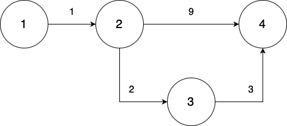

# Тестирование программы
Все тесты находятся в папке [PyTests](PyTests).
## [Простой тест](PyTests/Simple)
Проверка работы алгоритма на простом графе. Проверка правильности обхода и подсчета суммароной дистанции.

[Входные данные](PyTests/Simple/input.txt)

[Результат работы программы](PyTests/Simple/output.txt)

[Правильный ответ](PyTests/Simple/answer.txt)

## [Правильный путь](PyTests/RightPath)
Проверка правильности нахождения пути в простом графе.

[Входные данные](PyTests/RightPath/input.txt)

[Результат работы программы](PyTests/RightPath/output.txt)

[Правильный ответ](PyTests/RightPath/answer.txt)

## [Неориентированный граф](PyTests/UnorientedGraph)
Проверка работы алгоритма с неориетрованными ребрами.

[Входные данные](PyTests/UnorientedGraph/input.txt)

[Результат работы программы](PyTests/UnorientedGraph/output.txt)

[Правильный ответ](PyTests/UnorientedGraph/answer.txt)

## [Недостижимость](PyTests/Unreachable)
Провека работы алгоритма с недостижимыми вершинами.

[Входные данные](PyTests/Unreachable/input.txt)

[Результат работы программы](PyTests/Unreachable/output.txt)

[Правильный ответ](PyTests/Unreachable/answer.txt)

## [Сложный граф](PyTests/ComplexGraph)
Проверка работы алгоритма на сложном графе. Далее все тесты будут основываться на этом графе.

[Входные данные](PyTests/ComplexGraph/input.txt)

[Результат работы программы](PyTests/ComplexGraph/output.txt)

[Правильный ответ](PyTests/ComplexGraph/answer.txt)

## [Пустый строки](PyTests/EmptyLines)
Проверка работы алгоритма при наличии пустых строк.

[Входные данные](PyTests/EmptyLines/input.txt)

[Результат работы программы](PyTests/EmptyLines/output.txt)

[Правильный ответ](PyTests/EmptyLines/answer.txt)

## [Некорректные строки](PyTests/InvalidLine)
Проверка работы алгоритма при наличии некорректных строк.

[Входные данные](PyTests/InvalidLine/input.txt)

[Результат работы программы](PyTests/InvalidLine/output.txt)

[Правильный ответ](PyTests/InvalidLine/answer.txt)

## [Неверный порядок ввода](PyTests/NonFirstSearchPoints)
Проверка работы алгоритма при неверном порядке ввода строк.

[Входные данные](PyTests/NonFirstSearchPoints/input.txt)

[Результат работы программы](PyTests/NonFirstSearchPoints/output.txt)

[Правильный ответ](PyTests/NonFirstSearchPoints/answer.txt)

## [Добавление существующего ребра](PyTests/AddingExistingEdge)
Проверка работы алгоритма при попытке добавления уже существующего ребра.

[Входные данные](PyTests/AddingExistingEdge/input.txt)

[Результат работы программы](PyTests/AddingExistingEdge/output.txt)

[Правильный ответ](PyTests/AddingExistingEdge/answer.txt)

## [Добавление существующего неориентированного ребра](PyTests/AddingExistingUnorientedEdge)
Проверка работы алгоритма при попытке добавления уже существующего неориентированного ребра.

[Входные данные](PyTests/AddingExistingUnorientedEdge/input.txt)

[Результат работы программы](PyTests/AddingExistingUnorientedEdge/output.txt)

[Правильный ответ](PyTests/AddingExistingUnorientedEdge/answer.txt)

## [Несуществующая точка старта](PyTests/NonExistingStartRoom)
Проверка работы алгоритма при наличии несуществующей точки старта.

[Входные данные](PyTests/NonExistingStartRoom/input.txt)

[Результат работы программы](PyTests/NonExistingStartRoom/output.txt)

[Правильный ответ](PyTests/NonExistingStartRoom/answer.txt)

## [Несуществующая точка конца](PyTests/NonExistingEndRoom)
Проверка работы алгоритма при наличии несуществующей точки конца.

[Входные данные](PyTests/NonExistingEndRoom/input.txt)

[Результат работы программы](PyTests/NonExistingEndRoom/output.txt)

[Правильный ответ](PyTests/NonExistingEndRoom/answer.txt)